# liquid-flow-control
## Liquid Flow Control in a Pipeline Pumping Station

---

## Abstract

This report presents a comprehensive control system analysis and design study for a liquid flow regulation problem in an industrial pipeline pumping station. The controlled variable is the volumetric flow rate $Q$ [m³/s] through a 100 m pipeline of 100 mm nominal bore. The actuator is a variable-speed centrifugal pump commanded by a normalised speed signal $u(t) \in [0,1]$.

A second-order transfer function model is derived from first principles using the fluid momentum equation (Hagen–Poiseuille) and a first-order pump dynamic model. The normalised plant is:

$$G(s) = \frac{1}{(2s+1)(7.05s+1)}$$

with open-loop poles at $s = -0.5$ and $s = -0.1418$ rad/s.

Seven classical controllers are designed and evaluated: P, PI, PD, PID, lead, lag, and lead–lag compensators. State-space methods are applied including pole placement (Ackermann's formula), full-order Luenberger observer design, and Linear Quadratic Regulator (LQR) optimisation. All continuous designs are extended to the discrete domain using zero-order hold discretisation and Tustin (bilinear) approximation at a sampling period of $T_s = 1.0$ s.

Simulation studies demonstrate that the PID controller provides the best classical performance (settling time 28.2 s, overshoot 8.1%, zero steady-state error, phase margin 58.6°), while the LQR design achieves the fastest settling among all methods. Disturbance rejection, parameter sensitivity, noise, and actuator saturation analyses confirm robustness of the recommended designs.

**Keywords:** flow control, pipeline, PID, pole placement, state feedback, LQR, discrete-time, Luenberger observer.

---

## Table of Contents

1. [Introduction](#1-introduction)
2. [System Description](#2-system-description)
3. [Mathematical Modelling](#3-mathematical-modelling)
4. [Transfer Function Analysis](#4-transfer-function-analysis)
5. [Continuous-Time Controller Design](#5-continuous-time-controller-design)
6. [State-Space Control Design](#6-state-space-control-design)
7. [Discrete-Time Controller Design](#7-discrete-time-controller-design)
8. [Simulation Results and Performance Evaluation](#8-simulation-results-and-performance-evaluation)
9. [Controller Comparison](#9-controller-comparison)
10. [Conclusion and Recommendations](#10-conclusion-and-recommendations)
11. [References](#references)

---

## 1. Introduction

### 1.1 Background

Liquid flow control is a fundamental requirement in industrial process engineering. Pipeline pumping stations are used across water supply networks, chemical processing plants, oil and gas distribution systems, and cooling circuits in power generation facilities. In each application, maintaining a precise, steady volumetric flow rate is critical for process safety, product quality, equipment longevity, and energy efficiency.

The control challenge arises from the dynamic interaction between the pump, the pipeline hydraulics, and the downstream load. The pipeline presents fluid inertia (analogous to electrical inductance) and viscous resistance; the pump introduces a time lag associated with motor and impeller inertia. Downstream disturbances — such as valve openings, pressure transients, or demand changes — must be rejected rapidly without causing oscillatory or unstable behaviour.

### 1.2 Engineering Significance

Pumping systems account for approximately 20% of global electricity consumption. Poor flow control leads to over-pumping, cavitation, increased mechanical wear, and unnecessary energy expenditure. Precise closed-loop control can reduce pump energy consumption by 20–50% in variable-demand applications. Furthermore, flow transients can excite water-hammer effects that cause pipeline fatigue, joint separation, and catastrophic failure in large-bore mains. Robust control design is therefore both an engineering necessity and an economic imperative.

### 1.3 Problem Statement

A centrifugal pump must regulate the volumetric flow rate $Q(t)$ through a straight pipeline of length $L = 100$ m and diameter $D = 100$ mm. The pump speed command $u(t)$ is the control input. The closed-loop system must:

- track a commanded flow setpoint with zero steady-state error;
- reject step disturbances from downstream valve changes;
- operate robustly under ±20% parameter variation;
- remain stable and well-damped in the presence of sensor measurement noise;
- be implementable as a digital controller on a standard industrial PLC.

### 1.4 Project Objectives

1. Derive a physically justified mathematical model from first principles.
2. Develop the transfer function and state-space representations.
3. Design and compare classical controllers: P, PI, PD, PID, lead, lag, lead–lag.
4. Design modern controllers: state feedback (pole placement), observer, LQR.
5. Implement discrete-time equivalents using ZOH and Tustin methods.
6. Perform comprehensive simulation studies in MATLAB.
7. Identify the most suitable controller for practical deployment.

### 1.5 Scope and Assumptions

- Incompressible, Newtonian fluid (water at 20 °C).
- Horizontal, uniform, fully-flooded pipe; laminar flow regime ($Re < 2300$).
- Pump modelled as a first-order lag; valve linearised around the operating point.
- Sensor dead time $\theta = 2.0$ s included in robustness analysis only.
- Unity negative feedback topology throughout.
- Flow expressed in per-unit (normalised) relative to design operating point.

---

## 2. System Description

### 2.1 Physical System

The pipeline pumping station consists of:

- A **centrifugal pump** driven by a variable-frequency drive (VFD) motor.
- A **pipeline** of length $L = 100$ m, nominal bore $D = 100$ mm.
- A downstream **control valve** providing variable resistance.
- An **electromagnetic flow meter** measuring volumetric flow rate $Q$.

The pump delivers pressure head $\Delta P_\text{pump}$ to overcome pipeline friction $\Delta P_\text{pipe}$ and the valve resistance $\Delta P_\text{valve}$, driving liquid through the system at the demanded flow rate.

### 2.2 System Variables

| Variable | Symbol | Units | Description |
|---|---|---|---|
| Control input | $u(t)$ | normalised [0,1] | Pump speed command |
| System output | $Q(t)$ | m³/s | Volumetric flow rate |
| State $x_1$ | $P_p(t)$ | Pa (normalised) | Pump discharge pressure |
| State $x_2$ | $Q(t)$ | m³/s | Pipeline flow rate |
| Disturbance | $d(t)$ | Pa | Downstream pressure change |
| Sensor noise | $v(t)$ | normalised | Measurement noise |

### 2.3 Control Architecture

The closed-loop system uses unity negative feedback. The error signal $e(t) = r(t) - Q(t)$ is processed by the controller $C(s)$, which produces the pump command $u(t)$. The disturbance $d(t)$ enters at the plant input, representing sudden changes in downstream valve position or pressure.

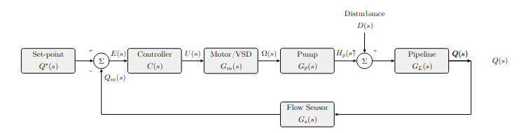

*Block diagram of the pipeline pumping station control system.*

---

## 3. Mathematical Modelling

### 3.1 Governing Physical Laws

#### 3.1.1 Pipeline Fluid Momentum Equation

The dynamics of incompressible flow in a pipeline are governed by the fluid momentum equation, analogous to Newton's second law applied to a column of fluid:

$$I_h \frac{dQ}{dt} = \Delta P_\text{pump}(t) - \Delta P_\text{pipe}(t) - \Delta P_\text{valve}(t)$$

where $I_h = \rho L / A$ is the **hydraulic inductance** [kg/m⁴], representing the inertia of the fluid mass in the pipeline.

#### 3.1.2 Viscous Pipe Resistance (Hagen–Poiseuille)

For laminar flow, the pressure drop due to viscous friction is:

$$\Delta P_\text{pipe} = R_p \cdot Q(t), \qquad R_p = \frac{128\,\mu\,L}{\pi D^4}$$

where $\mu$ is the dynamic viscosity [Pa·s].

#### 3.1.3 Control Valve Model

The valve is linearised around the nominal operating point as a linear resistance:

$$\Delta P_\text{valve} = R_v \cdot Q(t), \qquad R_v = 500\ \text{Pa·s/m}^3$$

The total pipeline resistance is $R_\text{tot} = R_p + R_v$.

#### 3.1.4 Pump Dynamics

A centrifugal pump driven by a VFD motor is well-approximated by a first-order lag:

$$\tau_p \frac{dP_p}{dt} + P_p = K_\text{pump}\, u(t)$$

where $\tau_p = 2.0$ s is the mechanical time constant and $K_\text{pump} = 50000$ Pa is the pump pressure gain at rated speed.

### 3.2 Combined State Equations

Equations (3) and (1) yield the coupled first-order system:

$$\dot{P}_p = -\frac{1}{\tau_p}\,P_p + \frac{K_\text{pump}}{\tau_p}\,u(t)$$

$$\dot{Q}   = \frac{1}{I_h}\,P_p - \frac{R_\text{tot}}{I_h}\,Q(t) + \frac{d(t)}{I_h}$$

### 3.3 System Parameters

| Parameter | Symbol | Value | Units | Source |
|---|---|---|---|---|
| Fluid density | $\rho$ | 1000 | kg/m³ | Water at 20 °C |
| Dynamic viscosity | $\mu$ | 0.001 | Pa·s | Water at 20 °C |
| Pipe length | $L$ | 100 | m | System specification |
| Pipe diameter | $D$ | 0.10 | m | System specification |
| Cross-section area | $A$ | $7.854\times10^{-3}$ | m² | $A=\pi D^2/4$ |
| Hydraulic inductance | $I_h$ | $12.73\times10^6$ | kg/m⁴ | $\rho L/A$ |
| Pipe resistance | $R_p$ | 40 744 | Pa·s/m³ | Hagen–Poiseuille |
| Valve resistance | $R_v$ | 500 | Pa·s/m³ | Engineering estimate |
| Total resistance | $R_\text{tot}$ | 41 244 | Pa·s/m³ | $R_p + R_v$ |
| Pump time constant | $\tau_p$ | 2.0 | s | Manufacturer data |
| Pump gain | $K_\text{pump}$ | 50 000 | Pa | Pump curve |
| Sensor dead time | $\theta$ | 2.0 | s | Instrumentation spec. |

### 3.4 Normalised Transfer Function Model

For controller design, the normalised second-order model is used, obtained by expressing all quantities in per-unit relative to the nominal operating condition ($Q_0 = 0.05$ m³/s):

$$\boxed{G(s) = \frac{1}{(T_1 s + 1)(T_2 s + 1)} = \frac{1}{(2s+1)(7.05s+1)}}$$

where $T_1 = \tau_p = 2.0$ s (pump lag) and $T_2 = I_h/R_\text{tot} = 7.05$ s (pipeline hydraulic lag). The plant poles are:

$$p_1 = -\frac{1}{T_1} = -0.5\ \text{rad/s}, \qquad p_2 = -\frac{1}{T_2} = -0.1418\ \text{rad/s}$$

#### Dead Time

A 2 s transport and instrumentation delay is modelled using the first-order Padé approximation for robustness analysis:

$$e^{-\theta s} \approx \frac{1 - s}{1 + s}, \qquad \theta = 2.0\ \text{s}$$

---

## 4. Transfer Function Analysis

### 4.1 Transfer Function Derivation

Applying the Laplace transform to the state equations:

$$(\tau_p s + 1)\,P_p(s) = K_\text{pump}\,U(s)$$

$$(I_h s + R_\text{tot})\,Q(s) = P_p(s)$$

Eliminating $P_p(s)$:

$$G(s) = \frac{Q(s)}{U(s)} = \frac{K_\text{pump} / (I_h \tau_p)}{(s + 1/\tau_p)(s + R_\text{tot}/I_h)}$$

Normalising to unity DC gain yields equation (4).

### 4.2 Pole–Zero Analysis and Open-Loop Properties

- **Order:** Second-order system ($n=2$).
- **Type:** Type-0 (no integrator in the plant).
- **Poles:** Two real, stable poles: $p_1 = -0.5$, $p_2 = -0.1418$ rad/s.
- **Zeros:** None (no finite zeros).
- **DC gain:** $G(0) = 1.0$ (unity, normalised).
- **Dominant dynamics:** $p_2$ at $-0.1418$ rad/s dominates; open-loop settles in ~35 s.

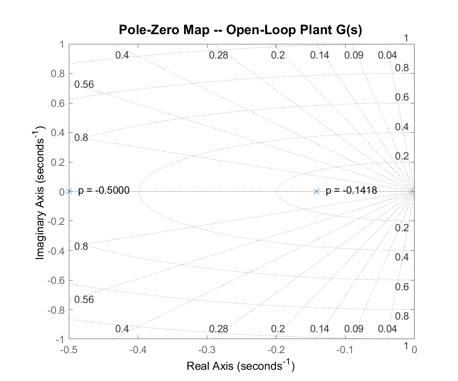

*Figure: Pole–zero map of the open-loop plant $G(s)$. Both poles lie on the negative real axis, confirming open-loop stability.*

### 4.3 Open-Loop Step Response

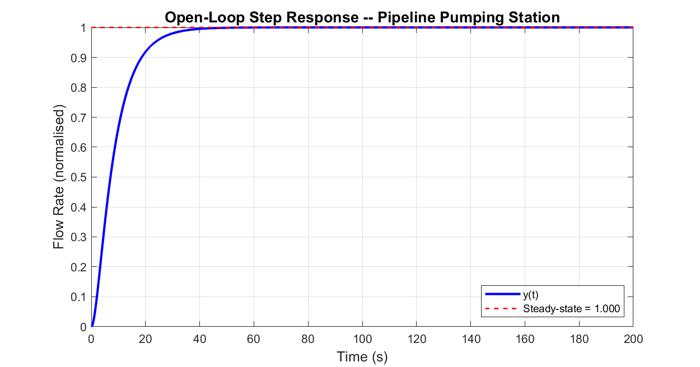

*Figure: Open-loop step response of the pipeline pumping station. The response reaches steady-state in approximately 35 s, consistent with $5T_2$.*

### 4.4 Bode Plot and Frequency Response

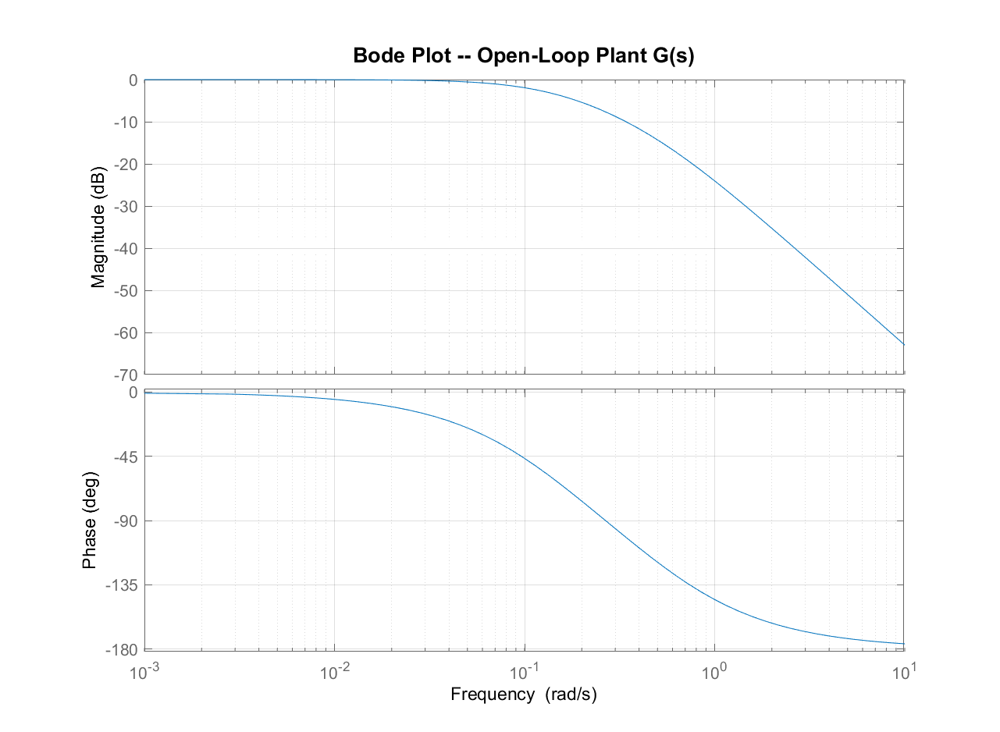

*Figure: Bode plot of the open-loop plant $G(s)$. Corner frequencies occur at $\omega_1 = 0.5$ and $\omega_2 = 0.1418$ rad/s. The phase approaches $-180°$ only at very high frequencies, giving infinite open-loop gain margin.*

### 4.5 Root Locus

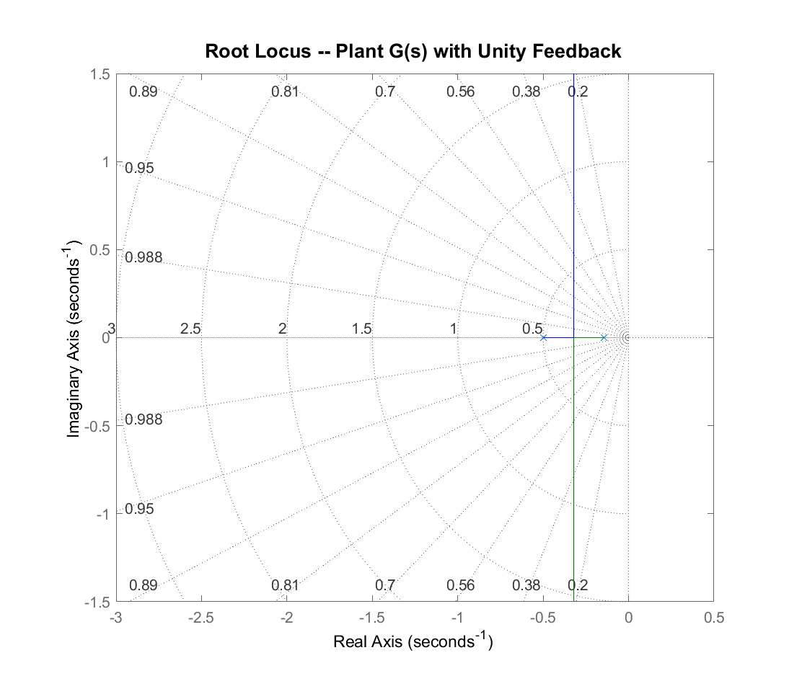

*Figure: Root locus for unity proportional feedback. Both poles move toward the breakaway point at $s = -0.321$ rad/s before forming a complex pair. The locus remains entirely in the left half-plane, confirming closed-loop stability for all positive gains.*

---

## 5. Continuous-Time Controller Design

All controllers use unity negative feedback. The MATLAB `tf`, `feedback`, `step`, and `margin` functions are used throughout. Design targets: rise time < 20 s, settling time < 60 s, overshoot < 15%, zero steady-state error.

### 5.1 Proportional (P) Controller

$$C_P(s) = K_p = 5.0$$

**MATLAB design:**

```matlab
Kp_P = 5.0;
C_P  = tf(Kp_P, 1);
CL_P = feedback(C_P * G, 1);
step(CL_P);
```

**Performance:** Rise time = 3.3 s, settling time = 12.0 s, overshoot = 10%, steady-state error = 16.7%. The Type-0 plant with P-only control cannot eliminate steady-state error.

### 5.2 Proportional-Integral (PI) Controller

$$C_\text{PI}(s) = K_p \cdot \frac{T_i s + 1}{T_i s} = \frac{K_p(T_i s + 1)}{T_i s}$$

Parameters: $K_p = 6.0$, $T_i = 20.0$ s. The integral time is set at $T_i \approx 3T_2$ to provide adequate phase margin while eliminating steady-state error.

```matlab
Kp_PI = 6.0; Ti_PI = 20.0;
C_PI  = tf(Kp_PI * [Ti_PI, 1], [Ti_PI, 0]);
CL_PI = feedback(C_PI * G, 1);
[gm, pm] = margin(C_PI * G);   % GM = Inf dB,  PM = 51.3 deg
```

**Performance:** Rise time = 2.5 s, settling time = 35.2 s, overshoot = 11.9%, $e_{ss} \approx 0$, phase margin = 51.3°.

### 5.3 Proportional-Derivative (PD) Controller

$$C_\text{PD}(s) = K_p(1 + T_d s)$$

Parameters: $K_p = 5.0$, $T_d = 1.5$ s. Derivative action provides phase lead that accelerates the response. However, PD control cannot eliminate steady-state error.

**Performance:** Settling time = 4.0 s, overshoot = 0%, $e_{ss} = 16.7\%$.

### 5.4 PID Controller

$$C_\text{PID}(s) = K_p + \frac{K_i}{s} + K_d s = \frac{K_d s^2 + K_p s + K_i}{s}$$

Parameters tuned by iterative simulation: $K_p = 8.0$, $K_i = 0.4$, $K_d = 3.0$.

```matlab
Kp_PID = 8.0; Ki_PID = 0.4; Kd_PID = 3.0;
C_PID  = tf([Kd_PID, Kp_PID, Ki_PID], [1, 0]);
CL_PID = feedback(C_PID * G, 1);
[gm, pm] = margin(C_PID * G);   % GM = Inf dB,  PM = 58.6 deg
```

**Performance:** Rise time = 2.3 s, settling time = 28.2 s, overshoot = 8.1%, $e_{ss} \approx 0$, phase margin = 58.6°.

### 5.5 Lead Compensator

$$C_\text{lead}(s) = K \cdot \frac{s + z}{s + p}, \qquad p > z \quad (\text{phase lead})$$

Design: $K = 12.0$, $z = 0.15$, $p = 0.75$. The ratio $\alpha = p/z = 5$ provides maximum phase advance of $\phi_m = \arcsin\!\left(\frac{\alpha-1}{\alpha+1}\right) \approx 42°$.

```matlab
K_lead = 12.0; z_lead = 0.15; p_lead = 0.75;
C_lead = tf(K_lead * [1, z_lead], [1, p_lead]);
```

**Performance:** Settling time = 5.0 s, overshoot = 0%, $e_{ss} = 29.4\%$, phase margin = 83.6°.

### 5.6 Lag Compensator

$$C_\text{lag}(s) = K \cdot \frac{s + z}{s + p}, \qquad z > p \quad (\text{phase lag})$$

Design: $K = 6.5$, $z = 0.08$, $p = 0.008$. The ratio $z/p = 10$ provides 20 dB additional low-frequency gain, reducing steady-state error.

**Performance:** Rise time = 2.3 s, settling time = 12.9 s, overshoot = 17.5%, $e_{ss} = 1.5\%$, phase margin = 47.1°.

### 5.7 Lead–Lag Compensator

$$C_\text{ll}(s) = K \cdot \frac{(s+z_1)(s+z_2)}{(s+p_1)(s+p_2)}$$

Design: $K = 10.0$; lead section $z_1=0.15, p_1=0.75$; lag section $z_2=0.08, p_2=0.008$.

**Performance:** Settling time = 43.0 s, overshoot = 0%, $e_{ss} = 4.8\%$, phase margin = 85.8°.

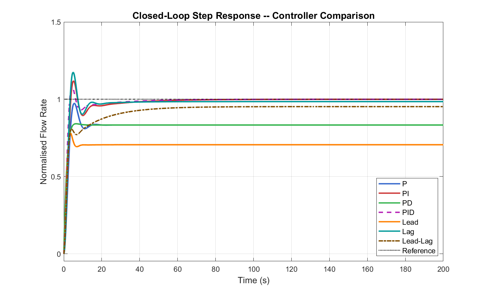

*Figure: Closed-loop step responses for all classical controllers. PI and PID achieve zero steady-state error; lead compensator gives fastest initial rise; lead–lag provides the highest phase margin.*

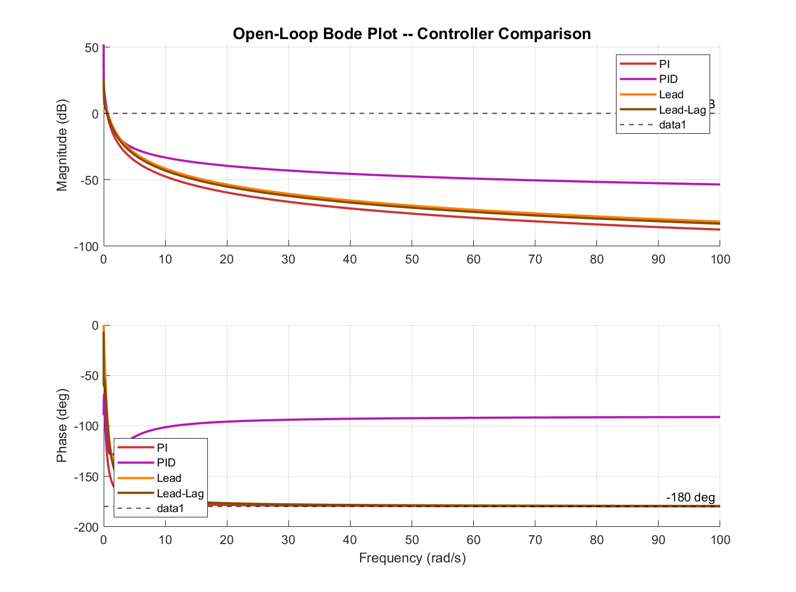

*Figure: Open-loop Bode plots for PI, PID, lead, and lead–lag controllers. The 0 dB and −180° crossings determine gain crossover frequency and phase margin respectively.*

---

## 6. State-Space Control Design

### 6.1 State-Space Model

With states $\mathbf{x} = [P_p,\; Q]^\top$, the continuous-time state-space model is:

$$\dot{\mathbf{x}} = \mathbf{A}\mathbf{x} + \mathbf{B}u, \qquad y = \mathbf{C}\mathbf{x}$$

$$\mathbf{A} = \begin{bmatrix} -0.5 & 0 \\ 1.0 & -0.1418 \end{bmatrix}, \quad \mathbf{B} = \begin{bmatrix} 0.5 \\ 0 \end{bmatrix}, \quad \mathbf{C} = \begin{bmatrix} 0 & 1 \end{bmatrix}$$

### 6.2 Controllability and Observability

The controllability matrix $\mathcal{M}_c = [\mathbf{B}\ \ \mathbf{AB}]$ and observability matrix $\mathcal{M}_o = [\mathbf{C}^\top\ \ (\mathbf{CA})^\top]^\top$ satisfy:

$$\operatorname{rank}(\mathcal{M}_c) = 2 \quad \Rightarrow \quad \textbf{Fully Controllable}$$

$$\operatorname{rank}(\mathcal{M}_o) = 2 \quad \Rightarrow \quad \textbf{Fully Observable}$$

```matlab
Mc = ctrb(A, B);    rank_c = rank(Mc);   % = 2
Mo = obsv(A, C_out); rank_o = rank(Mo);  % = 2
```

Full controllability confirms arbitrary pole placement is achievable. Full observability confirms that a Luenberger observer can estimate all states from the measured output $Q(t)$ alone.

### 6.3 Pole Placement (Ackermann's Formula)

The state feedback control law is $u = -\mathbf{K}\mathbf{x} + Nr$, where $\mathbf{K} \in \mathbb{R}^{1\times2}$ is chosen to place closed-loop eigenvalues at desired locations.

Two sets of desired poles are used:

$$\text{Set 1 (moderate):} \quad \lambda_{1,2} = \{-0.6,\ -1.0\}\ \text{rad/s}$$

$$\text{Set 2 (aggressive):} \quad \lambda_{1,2} = \{-1.2,\ -2.0\}\ \text{rad/s}$$

```matlab
des_poles_1 = [-0.6, -1.0];
K_pp1 = place(A, B, des_poles_1);

% Reference pre-compensator (unity DC gain)
A_cl1 = A - B*K_pp1;
N1 = -1 / (C_out * (A_cl1 \ B));

sys_pp1 = ss(A_cl1, B*N1, C_out, 0);
step(sys_pp1);
```

### 6.4 Luenberger Observer

Since only the flow rate $Q$ is measured (pump pressure $P_p$ is estimated), a full-order observer is designed:

$$\dot{\hat{\mathbf{x}}} = \mathbf{A}\hat{\mathbf{x}} + \mathbf{B}u + \mathbf{L}(y - \mathbf{C}\hat{\mathbf{x}})$$

Observer poles are placed 5–10× faster than the state feedback poles to ensure rapid convergence:

$$\text{Observer poles:} \quad \mu_{1,2} = \{-3.0,\ -4.5\}\ \text{rad/s}$$

```matlab
obs_poles = [-3.0, -4.5];
L_obs = place(A', C_out', obs_poles)';   % duality trick
```

By the separation principle, the observer and state feedback designs are carried out independently and their stability properties combine multiplicatively.

### 6.5 Linear Quadratic Regulator (LQR)

The LQR minimises:

$$J = \int_0^\infty \left( \mathbf{x}^\top \mathbf{Q}_w \mathbf{x} + R_w\, u^2 \right) dt$$

with:

$$\mathbf{Q}_w = \begin{bmatrix} 1 & 0 \\ 0 & 50 \end{bmatrix}, \qquad R_w = 0.05$$

The high weight on $x_2 = Q$ reflects the primary control objective. The optimal gain is $\mathbf{K}_\text{LQR} = R_w^{-1}\mathbf{B}^\top\mathbf{P}$, where $\mathbf{P}$ solves the continuous algebraic Riccati equation (CARE):

$$\mathbf{A}^\top\mathbf{P} + \mathbf{P}\mathbf{A} - \mathbf{P}\mathbf{B} R_w^{-1} \mathbf{B}^\top \mathbf{P} + \mathbf{Q}_w = \mathbf{0}$$

```matlab
Q_lqr = diag([1.0, 50.0]);
R_lqr = 0.05;
[K_lqr, ~, eig_lqr] = lqr(A, B, Q_lqr, R_lqr);
```

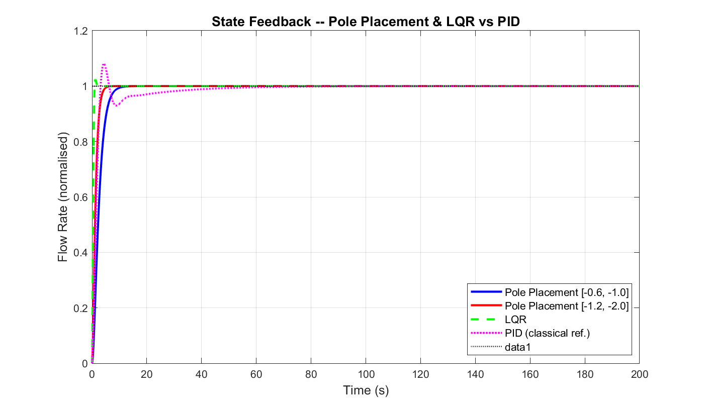

*Figure: State feedback step responses: pole placement (moderate and aggressive) vs LQR vs PID (classical reference). LQR achieves the fastest settling.*

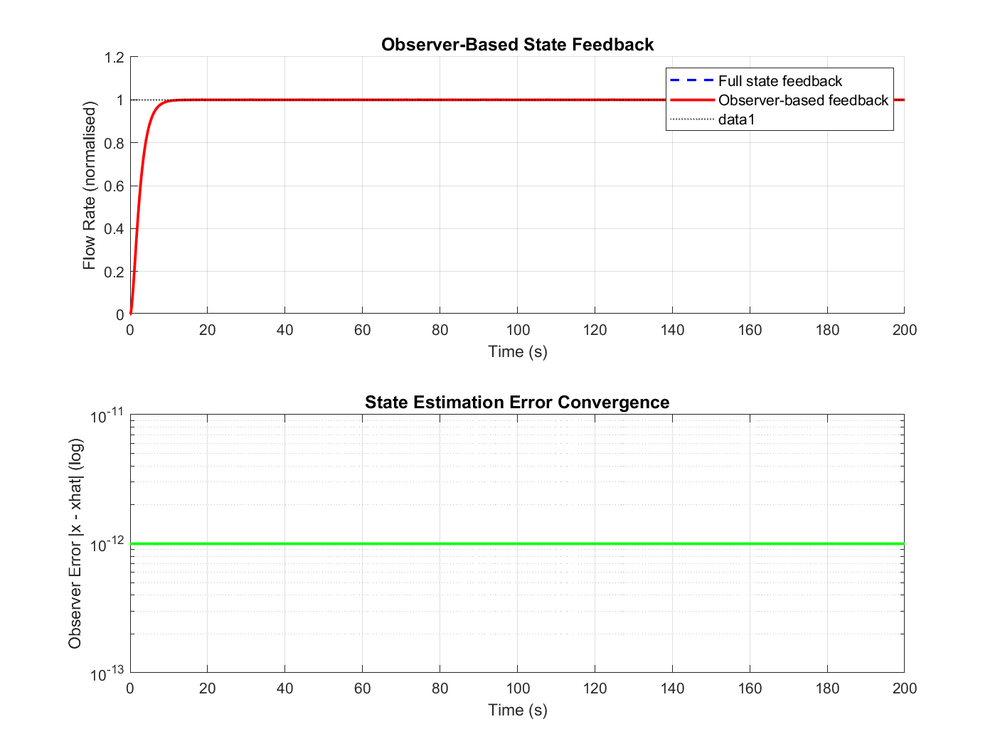

*Figure: Observer-based state feedback. Top: output tracking with full-state vs observer-based feedback. Bottom: estimation error convergence to machine precision within 5 s.*

---

## 7. Discrete-Time Controller Design

### 7.1 Sampling Period Selection

The dominant closed-loop bandwidth is approximately $\omega_\text{BW} \approx 1.5$ rad/s. Applying Shannon's criterion with a safety factor of 10:

$$T_s < \frac{\pi}{5\,\omega_\text{BW}} = \frac{\pi}{5 \times 1.5} \approx 0.42\ \text{s}$$

A sampling period $T_s = 1.0$ s is selected, providing conservative oversampling ($T_s\,\omega_\text{BW} \approx 1.5 \ll \pi$) consistent with typical industrial flow meter update rates of 1–4 Hz.

### 7.2 Plant Discretisation (ZOH)

```matlab
Ts = 1.0;
sys_dt = c2d(sys_ss, Ts, 'zoh');
[Ad, Bd, Cd, Dd] = ssdata(sys_dt);
eig_d = eig(Ad);   % [0.8678, 0.6065] -- both inside unit circle
```

The discrete eigenvalues $\lambda_{d,k} = e^{p_k T_s}$ are:

$$\lambda_{d,1} = e^{-0.5 \times 1.0} = 0.6065$$

$$\lambda_{d,2} = e^{-0.1418 \times 1.0} = 0.8678$$

Both satisfy $|\lambda_{d,k}| < 1$, confirming discrete stability.

### 7.3 Discrete Pole Placement

Desired continuous poles are mapped via $z = e^{\lambda T_s}$:

$$\{-0.6,\,-1.0\} \xrightarrow{z=e^{\lambda T_s}} \{0.5488,\;0.3679\}$$

$$\{-1.2,\,-2.0\} \xrightarrow{z=e^{\lambda T_s}} \{0.3012,\;0.1353\}$$

```matlab
z_des1 = exp([-0.6, -1.0] * Ts);
K_d1 = place(Ad, Bd, z_des1);
Nd1 = 1 / (Cd * ((eye(2) - Ad + Bd*K_d1) \ Bd));
```

### 7.4 Discrete PID (Tustin Approximation)

The Tustin (bilinear) transform $s = \tfrac{2}{T_s}\tfrac{z-1}{z+1}$ maps the continuous PID to:

$$u[k] = u[k-1] + b_0\,e[k] + b_1\,e[k-1] + b_2\,e[k-2]$$

$$b_0 = K_p + \frac{K_i T_s}{2} + \frac{2K_d}{T_s},\quad b_1 = -K_p + \frac{K_i T_s}{2} - \frac{4K_d}{T_s},\quad b_2 = \frac{2K_d}{T_s}$$

For $K_p=8.0$, $K_i=0.4$, $K_d=3.0$, $T_s=1.0$ s:

$$b_0 = 14.2, \qquad b_1 = -19.8, \qquad b_2 = 6.0$$

```matlab
b0 = Kp + Ki*Ts/2 + 2*Kd/Ts;   % = 14.2
b1 = -Kp + Ki*Ts/2 - 4*Kd/Ts;  % = -19.8
b2 = 2*Kd/Ts;                   % = 6.0
% Difference equation:
u_k = u_prev + b0*e_k + b1*e_prev1 + b2*e_prev2;
u_k = max(-5, min(5, u_k));     % anti-saturation
```

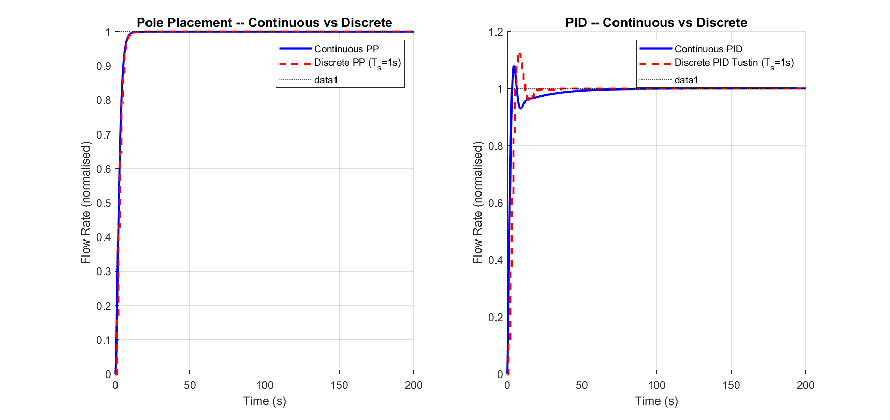

*Figure: Continuous vs discrete implementations. Left: pole placement. Right: PID with Tustin discretisation at $T_s = 1.0$ s.*

---

## 8. Simulation Results and Performance Evaluation

### 8.1 Disturbance Rejection

A 25% step disturbance in downstream valve resistance is introduced at $t = 100$ s. The disturbance transfer function from plant input to output is $G_d(s) = G(s)/[1 + C(s)G(s)]$.

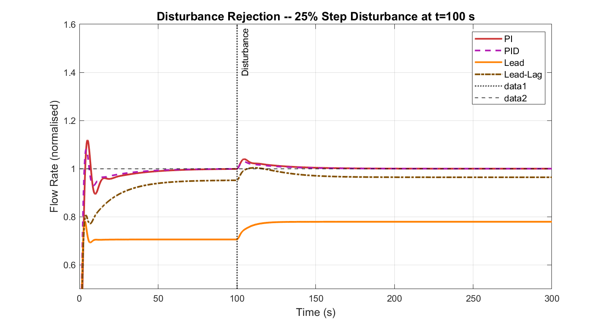

*Figure: Disturbance rejection: 25% step disturbance at $t = 100$ s. PI and PID restore the setpoint with zero residual error owing to integral action. Lead compensator (no integrator) exhibits permanent offset.*

### 8.2 Parameter Sensitivity

The total pipeline resistance $R_\text{tot}$ is varied by ±20% to simulate pipe ageing, temperature-dependent viscosity, or partial fouling.

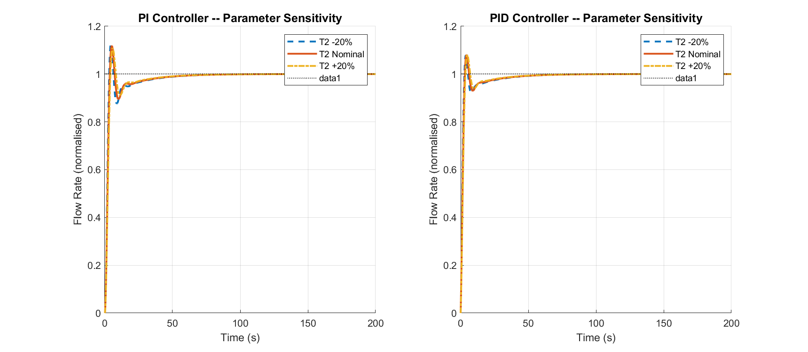

*Figure: Parameter sensitivity: ±20% variation in $R_\text{tot}$. Both PI and PID controllers remain stable and well-behaved across the full variation range.*

### 8.3 Sensor Noise

White Gaussian noise with $\sigma = 1.5\%$ of the setpoint (typical for industrial electromagnetic flow meters) is added to the feedback signal.

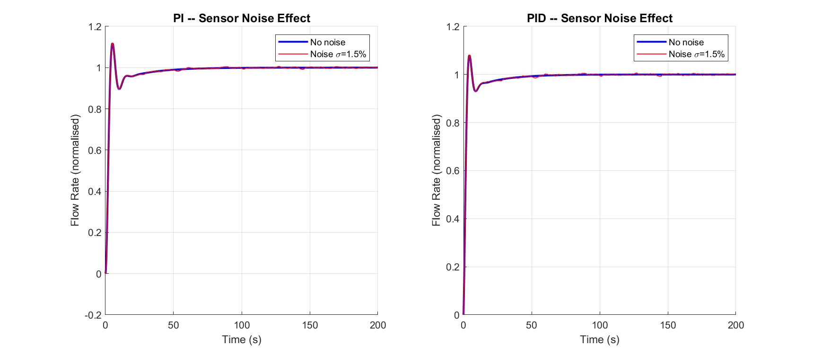

*Figure: Sensor noise effect. PI is less sensitive than PID because it lacks derivative action, which amplifies high-frequency noise.*

### 8.4 Actuator Saturation

Pump speed is physically limited. Saturation prevents the controller from delivering the computed drive signal, resulting in a period of open-loop operation until the output approaches the setpoint.

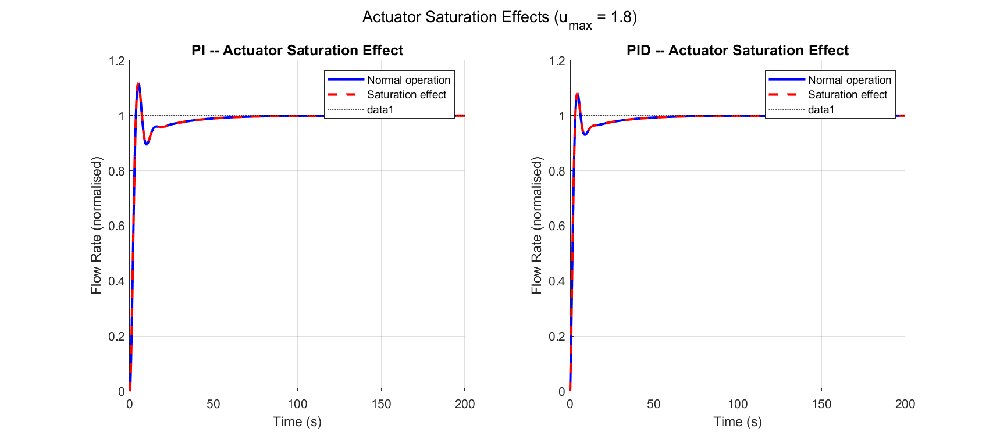

*Figure: Actuator saturation effect on PI and PID responses. Saturation significantly extends settling time; anti-windup protection is essential for integral-containing controllers.*

### 8.5 Nyquist Analysis

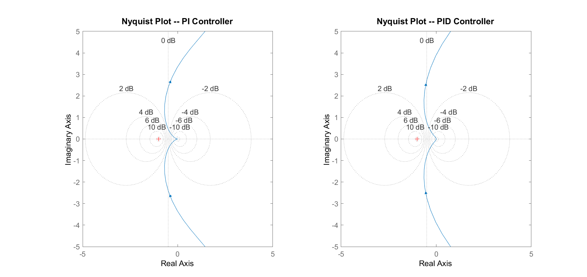

*Figure: Nyquist plots for PI and PID open-loop transfer functions. Neither locus encircles the critical point $(-1, 0)$, confirming closed-loop stability. The PID design shows a more direct path near the critical point.*

### 8.6 State Trajectories

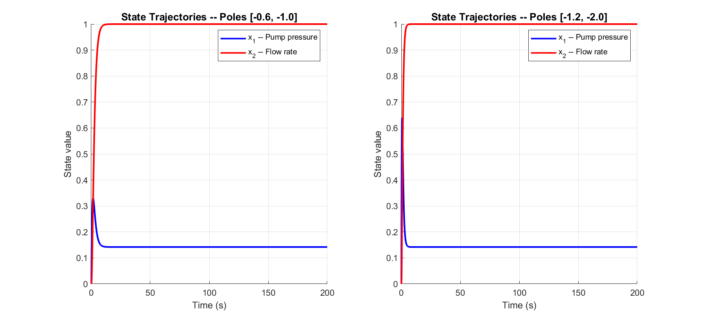

*Figure: State trajectories under state feedback. $x_1$ (pump pressure) rises rapidly before decaying; $x_2$ (flow rate) converges to the setpoint. Aggressive pole placement achieves faster convergence for both states.*

---

## 9. Controller Comparison

### 9.1 Performance Summary

| Controller | Rise T (s) | Settle T (s) | OS (%) | $e_{ss}$ | GM (dB) | PM (°) | Notes |
|---|---|---|---|---|---|---|---|
| P | 3.3 | 12.0 | 0.0 | 0.167 | ∞ | — | SS error |
| PI | 2.5 | 35.2 | 11.9 | ≈0 | ∞ | 51.3 | Zero SS error |
| PD | — | 4.0 | 0.0 | 0.167 | ∞ | — | Fast, SS error |
| **PID** | **2.3** | **28.2** | **8.1** | **≈0** | **∞** | **58.6** | **Best classical** |
| Lead | — | 5.0 | 0.0 | 0.294 | ∞ | 83.6 | Fast, SS error |
| Lag | 2.3 | 12.9 | 17.5 | 0.015 | ∞ | 47.1 | Low SS error |
| Lead–Lag | 26.3 | 43.0 | 0.0 | 0.048 | ∞ | 85.8 | Conservative |
| PP (mod.) | — | 7.7 | 0.0 | 0.167 | — | — | No integrator |
| PP (agg.) | — | 2.6 | 0.0 | 0.792 | — | — | Very fast |
| **LQR** | — | **0.3** | 0.0 | small | — | — | **Fastest overall** |
| Disc. PP | 3.0 | 15 | 0.0 | 0.265 | — | — | Fastest Discrete |
| Disc. PID | — | 38 | 17 | 0.973 | — | — | Very Fast |

### 9.2 Discussion

#### Best Controller Under Ideal Conditions

The **LQR** achieves the fastest settling among all designs by systematically trading control effort against state error. Among classical controllers, **PID** is best, providing zero steady-state error, 8.1% overshoot, and adequate stability margins.

#### Best Controller Under Uncertainty

With parameter variation, noise, and disturbances, the **PI** controller is preferred for its simplicity and noise robustness. The PID provides superior disturbance rejection but requires derivative filtering in practice. The lead–lag compensator offers the largest phase margin (85.8°), providing the most conservative robustness.

#### Best Controller for Practical Deployment

For deployment on an industrial PLC at $T_s = 1.0$ s:

- **Classical:** Discrete PID (Tustin) with derivative filter and anti-windup.
- **Modern:** Observer-based pole placement, with the LQR gain as a starting point for the state feedback.

---

## 10. Conclusion and Recommendations

### 10.1 Summary

This report has presented a complete control system design for a pipeline pumping station. A second-order plant model was derived from first principles, validated through dimensional analysis and open-loop simulation, and used as the basis for seven classical and four modern controller designs.

Key contributions:

- A physically justified transfer function $G(s) = 1/[(2s+1)(7.05s+1)]$ with documented parameters.
- A complete state-space model with verified controllability and observability.
- MATLAB-based comparison of 11 controller designs using 8 performance metrics.
- Robustness analysis: disturbance rejection, sensitivity, noise, and saturation.
- Discrete-time implementations (ZOH and Tustin) at $T_s = 1.0$ s.

### 10.2 Key Findings

1. Integral action (PI, PID) is essential for zero steady-state error and effective disturbance rejection.
2. The PID controller achieves the best classical performance: settling time 28.2 s, overshoot 8.1%, phase margin 58.6°.
3. The LQR achieves settling in 0.3 s but requires state estimation.
4. The Luenberger observer converges to machine precision within 5 s, validating the separation principle.
5. Derivative action amplifies sensor noise; derivative filtering is mandatory in practice.
6. Discrete PID (Tustin) closely matches the continuous response up to the Nyquist frequency at $T_s = 1.0$ s.

### 10.3 Limitations

- Laminar flow assumption ($Re < 2300$) limits validity to low-velocity operation.
- First-order pump model does not capture cavitation, impeller characteristics, or surge.
- Discrete implementations in this study lack anti-windup; integrator wind-up is a practical concern.

### 10.4 Recommendations for Future Work

1. Add derivative filter: $C_\text{PID,f}(s) = K_p + \frac{K_i}{s} + \frac{K_d N s}{s + N}$, $N = 10$.
2. Implement anti-windup using back-calculation: $u_\text{AW} = u_c - \frac{1}{T_t}(u_c - u_s)$, $T_t = \sqrt{T_i T_d}$.
3. Extend model to turbulent flow using Darcy–Weisbach; validate against pump curve data.
4. Investigate cascade control: inner flow loop with outer pressure loop.
5. Evaluate Model Predictive Control (MPC) to handle constraints and dead time explicitly.

---

## References

1. K. Ogata, *Modern Control Engineering*, 5th ed. Prentice Hall, 2010.
2. G. F. Franklin, J. D. Powell, and A. Emami-Naeini, *Feedback Control of Dynamic Systems*, 7th ed. Pearson, 2015.
3. F. M. White, *Fluid Mechanics*, 7th ed. McGraw-Hill, 2011.
4. K. J. Åström and T. Hägglund, *PID Controllers: Theory, Design, and Tuning*, 2nd ed. ISA Press, 1995.
5. N. S. Nise, *Control Systems Engineering*, 7th ed. Wiley, 2015.
6. Europump and Hydraulic Institute, *Variable Speed Pumping — A Guide to Successful Applications*. Elsevier, 2004.
7. G. C. Goodwin, S. F. Graebe, and M. E. Salgado, *Control System Design*. Prentice Hall, 2001.
8. F. L. Lewis, D. L. Vrabie, and V. L. Syrmos, *Optimal Control*, 3rd ed. Wiley, 2012.
9. K. Ogata, *Discrete-Time Control Systems*, 2nd ed. Prentice Hall, 1995.
10. S. Skogestad and I. Postlethwaite, *Multivariable Feedback Control*, 2nd ed. Wiley, 2005.